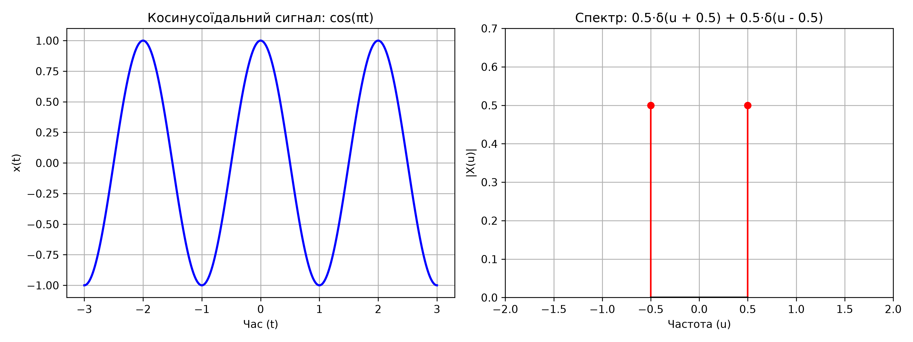
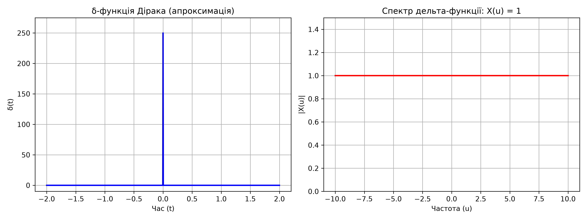
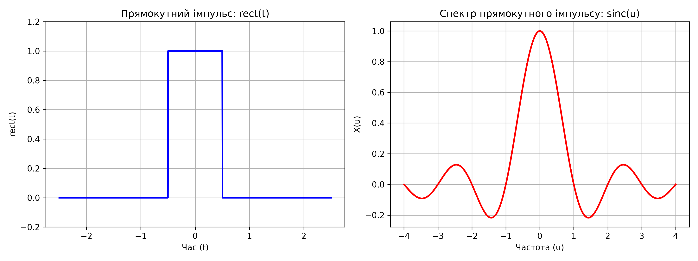
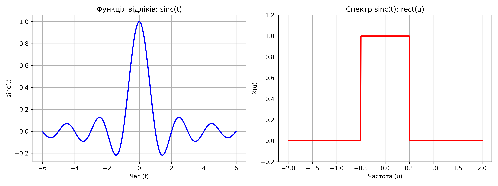
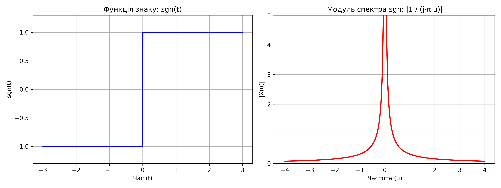
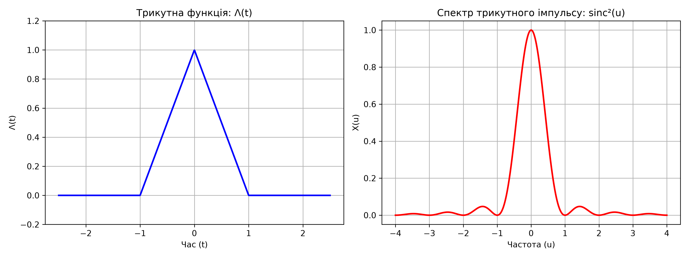

# Лабораторна робота №1

## Детерміновані сигнали для обробки інформації

Програма будує сигнали в часовій області, показує відповідні спектри та зберігає всі графіки в папку `plots`.

## Досліджені сигнали

1. Гармонічний сигнал $x(t) = \cos(\pi t)$.
2. Дельта-функція Дірака $\delta(t)$.
3. Прямокутний імпульс `rect(t)`.
4. Функція відліків `sinc(t)`.
5. Функція знаку `sgn(t)`.
6. Трикутна функція $\Lambda(t)$.

## Результати

### Гармонічний сигнал



### Дельта-функція Дірака



### Прямокутний імпульс



### Функція відліків



### Функція знаку



### Трикутна функція



## Запуск програми

Перейдіть до папки лабораторної та запустіть програму:

```powershell
cd lab01
py main.py
```
