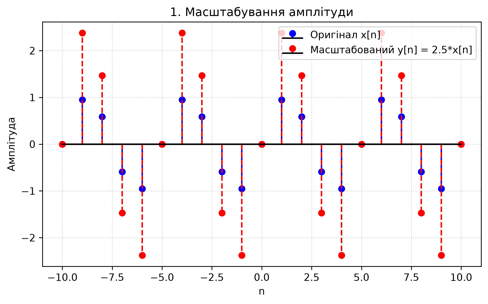
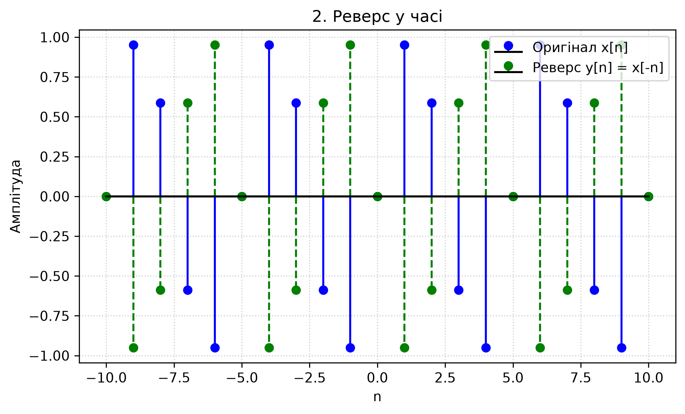
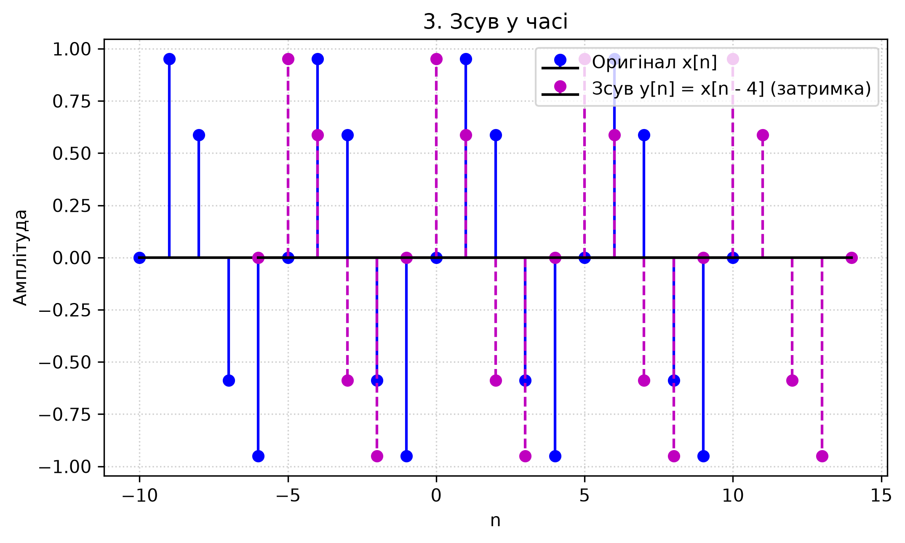
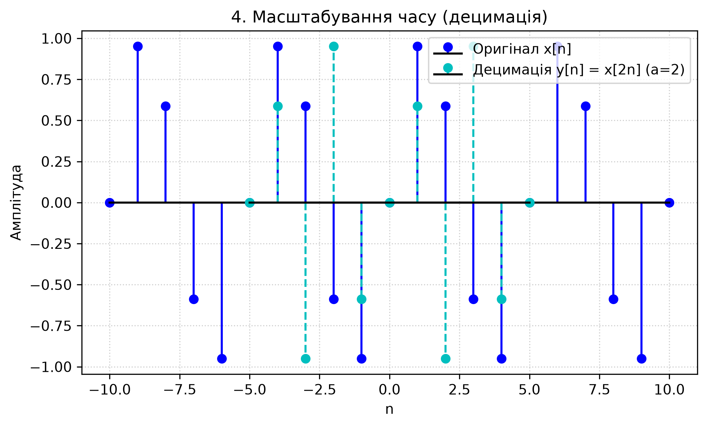
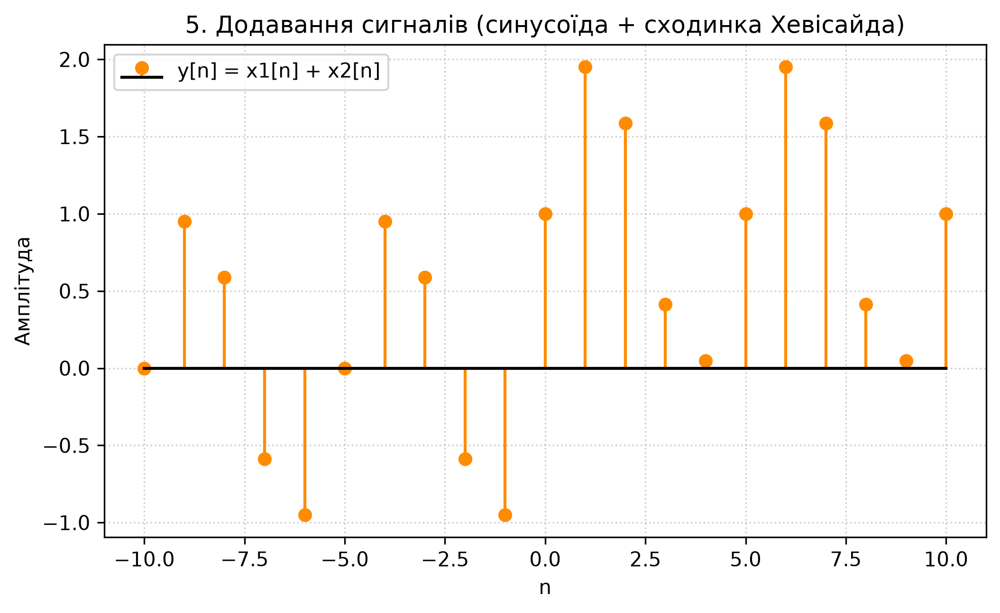
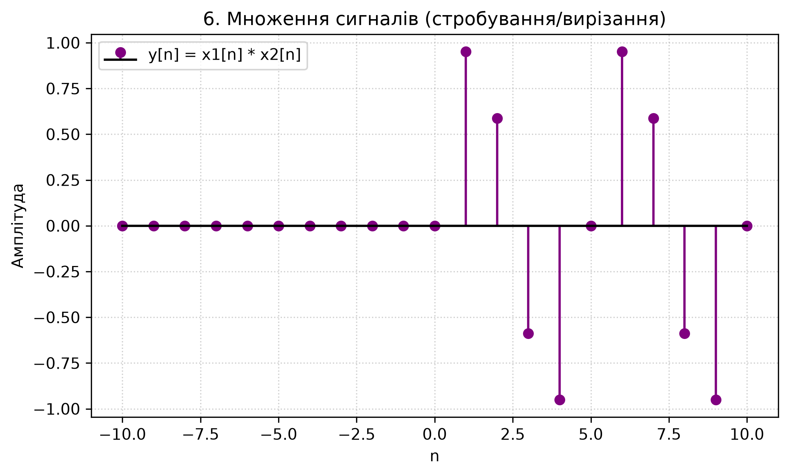

# Лабораторна робота №2

## Основні операції над сигналами

Програма виконує базові операції над дискретними сигналами та зберігає отримані графіки в папку `plots`.

## Реалізовані операції

1. Масштабування амплітуди.
2. Реверс сигналу в часі.
3. Зсув сигналу в часі.
4. Масштабування часу шляхом децимації.
5. Додавання двох сигналів.
6. Множення двох сигналів.

## Результати

### Масштабування амплітуди



### Реверс у часі



### Зсув у часі



### Децимація



### Додавання сигналів



### Множення сигналів



## Запуск програми

Перейдіть до папки лабораторної та запустіть програму:

```powershell
cd lab02
py main.py
```
