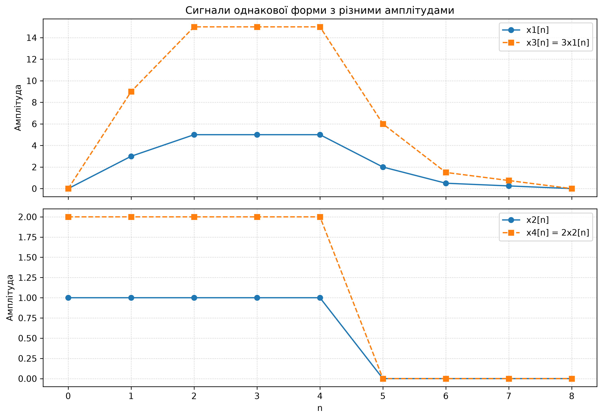
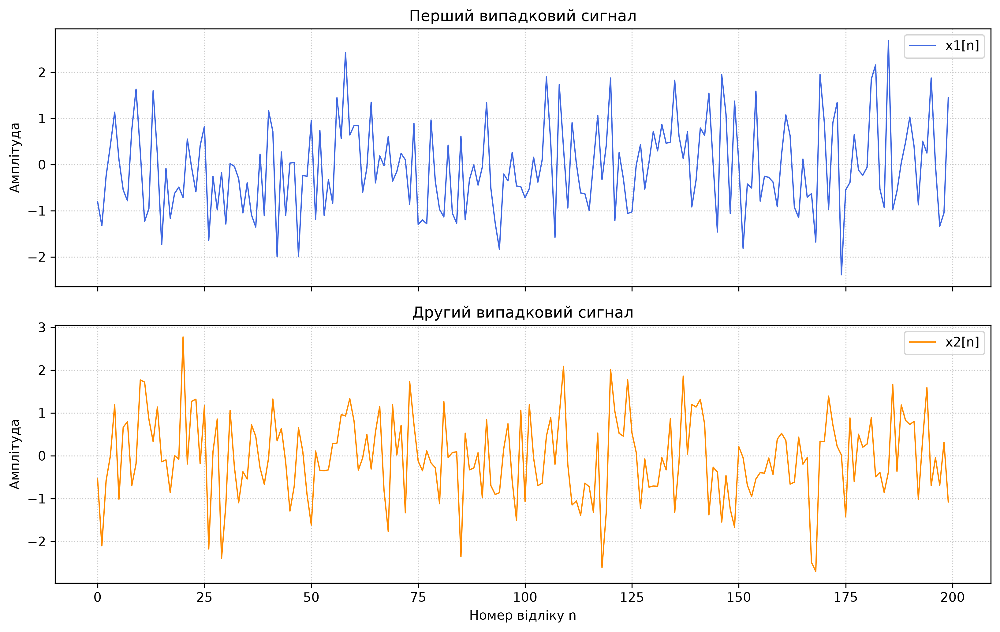
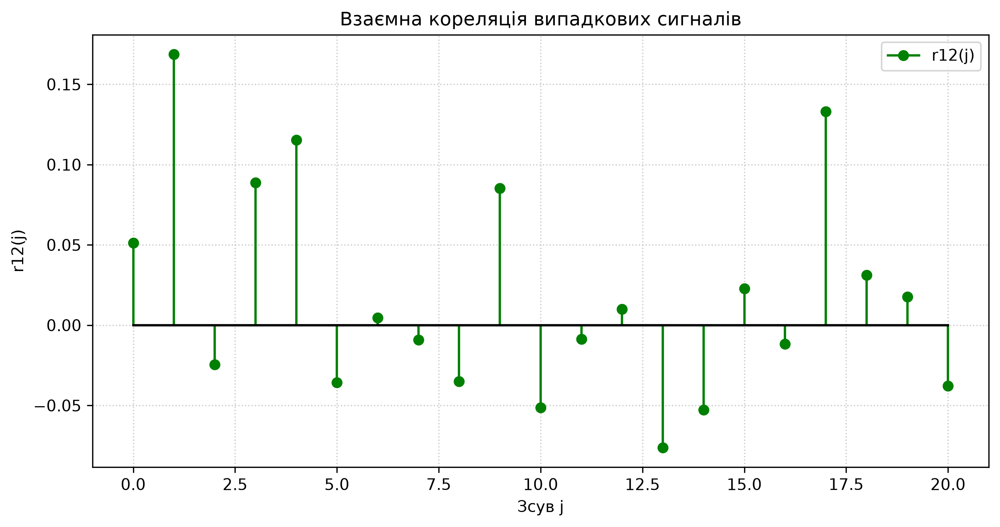
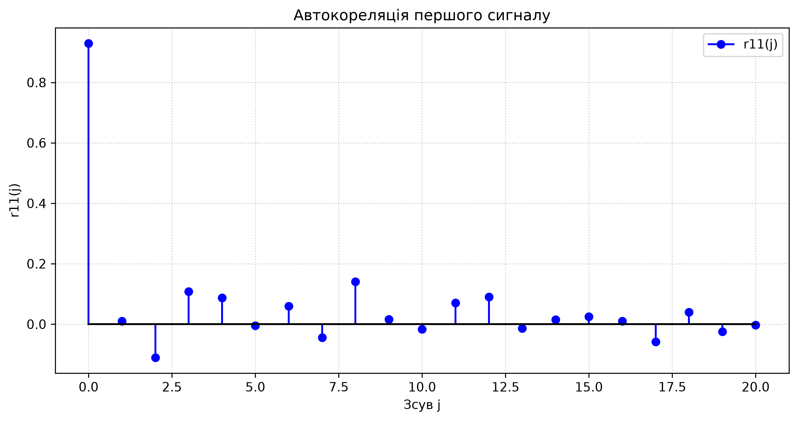
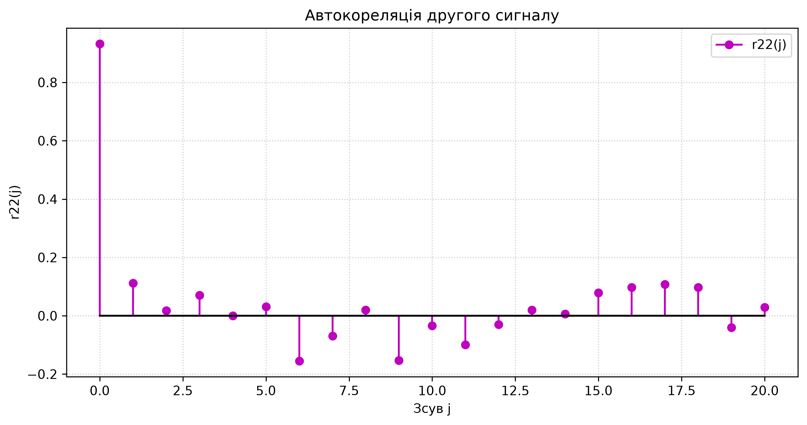
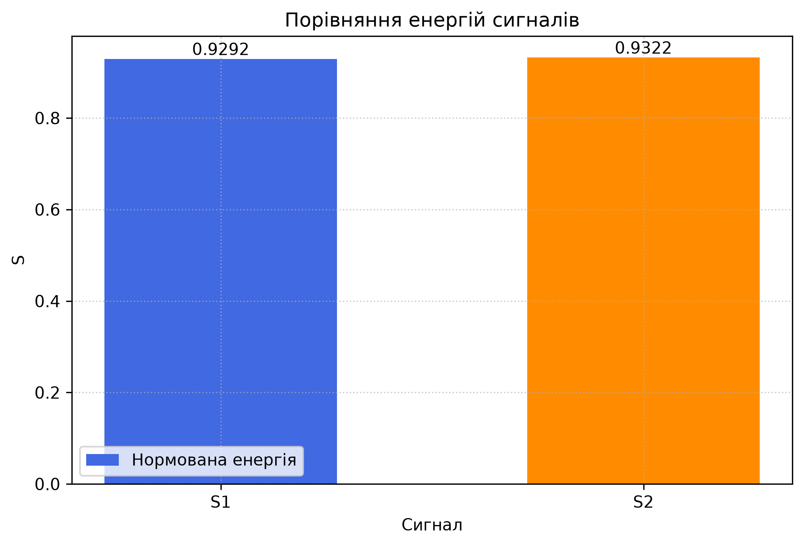

# Лабораторна робота №3

## Кореляція та автокореляція сигналів

Програма виконує розрахунки за методичкою, генерує два незалежні випадкові
сигнали та будує графіки їх взаємної кореляції й автокореляції.

## Результати для таблиці 1

Порожні клітинки другого сигналу доповнено нулями.

| Величина | Значення |
|---|---:|
| Взаємна кореляція $r_{12}(0)$ | 2.666667 |

## Результати для таблиці 2

| Величина | Пара $x_1, x_2$ | Пара $x_3, x_4$ |
|---|---:|---:|
| Звичайна кореляція | 2.000000 | 12.000000 |
| Нормуючий коефіцієнт | 2.334821 | 14.008926 |
| Нормована кореляція | 0.856597 | 0.856597 |

Звичайні кореляції різняться через різні амплітуди сигналів. Після нормування
отримуємо однакове значення, тому що форми обох пар сигналів однакові.

## Аналіз випадкових сигналів

- Кількість відліків: **200**.
- Діапазон зсувів: **$j=0\ldots20$**.
- Нормована енергія першого сигналу: **0.929196**.
- Нормована енергія другого сигналу: **0.932179**.
- Найбільше за модулем значення взаємної кореляції отримано при
  **$j=1$**:
  **0.168676**.
- $r_{11}(0)=0.929196$, що дорівнює $S_1$.
- $r_{22}(0)=0.932179$, що дорівнює $S_2$.

### Початкові сигнали

### Взаємна кореляція

Значення коливаються біля нуля, тому між незалежно згенерованими сигналами
немає помітного лінійного зв'язку.

### Автокореляція першого сигналу

### Автокореляція другого сигналу

Обидві автокореляційні функції мають виражений максимум при нульовому зсуві.
Для інших зсувів значення знаходяться біля нуля, що характерно для шумових
випадкових сигналів.

### Порівняння енергій

